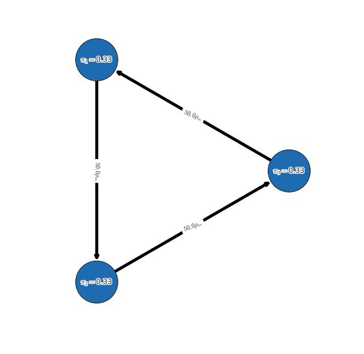
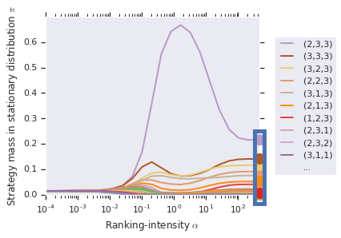

# α-Rank

OpenSpiel now supports using Alpha-Rank
([“α-Rank: Multi-Agent Evaluation by Evolution”, 2019](https://www.nature.com/articles/s41598-019-45619-9))
for both single-population (symmetric) and multi-population games. Specifically,
games can be specified via payoff tables (or tensors for the >2 players case) as
well as Heuristic Payoff Tables (HPTs).

The following presents several typical use cases for Alpha-Rank. For an example
complete python script, refer to
[open_spiel/python/egt/examples/alpharank_example.py](https://github.com/deepmind/open_spiel/blob/master/open_spiel/python/egt/examples/alpharank_example.py).

## Importing the Alpha-Rank module

```python
from open_spiel.python.egt import alpharank
from open_spiel.python.egt import alpharank_visualizer
```

## Running Alpha-Rank on various games

### Example: symmetric 2-player game rankings

In this example, we run Alpha-Rank on a symmetric 2-player game
(Rock-Paper-Scissors), computing and outputting the rankings in a tabular
format. We demonstrate also the conversion of standard payoff tables to
Heuristic Payoff Tables (HPTs), as both are supported by the ranking code.

```python
# Load the game
game = pyspiel.load_matrix_game("matrix_rps")
payoff_tables = utils.game_payoffs_array(game)

# Convert to heuristic payoff tables
payoff_tables= [heuristic_payoff_table.from_matrix_game(payoff_tables[0]),
                heuristic_payoff_table.from_matrix_game(payoff_tables[1].T)]

# Check if the game is symmetric (i.e., players have identical strategy sets
# and payoff tables) and return only a single-player’s payoff table if so.
# This ensures Alpha-Rank automatically computes rankings based on the
# single-population dynamics.
_, payoff_tables = utils.is_symmetric_matrix_game(payoff_tables)

# Compute Alpha-Rank
(rhos, rho_m, pi, num_profiles, num_strats_per_population) = alpharank.compute(
    payoff_tables, alpha=1e2)

# Report results
alpharank.print_results(payoff_tables, payoffs_are_hpt_format, pi=pi)
```

**Output**

```bash
Agent        Rank         Score
-----        ----         -----
0            1            0.33
1            1            0.33
2            1            0.33
```

### Example: multi-population game rankings

The next example demonstrates computing Alpha-Rank on an asymmetric 3-player
meta-game, constructed by computing payoffs for Kuhn poker agents trained via
extensive-form fictitious play (XFP). Here we use a helper function,
`compute_and_report_alpharank`, which internally conducts the pre-processing and
visualization shown in the previous example.

```python
# Load the game
payoff_tables = alpharank_example.get_kuhn_poker_data(num_players=3)

# Helper function for computing & reporting Alpha-Rank outputs
alpharank.compute_and_report_alpharank(payoff_tables, alpha=1e2)
```

**Output**

```bash
Agent        Rank         Score
-----        ----         -----
(2,3,3)      1            0.22
(3,3,3)      2            0.14
(3,2,3)      3            0.12
(2,2,3)      4            0.09
(3,1,3)      5            0.08
(2,1,3)      6            0.05
(1,2,3)      7            0.04
(2,3,1)      8            0.02
...          ...          ...
```


## Visualizing and reporting results

This section provides details on various methods used for reporting the final
Alpha-Rank results.

### Basic Ranking Outputs

The final rankings computed can be printed in a tabular manner using the
following interface:

```python
alpharank.print_results(payoff_tables, payoffs_are_hpt_format, pi=pi)
```

**Output**

```txt
Agent        Rank         Score
-----        ----         -----
0            1            0.33
1            1            0.33
2            1            0.33
```

### Markov Chain Visualization

One may visualize the Alpha-Rank Markov transition matrix as follows:

```python
m_network_plotter = alpharank_visualizer.NetworkPlot(payoff_tables, rhos,
                                                     rho_m, pi,strat_labels,
                                                     num_top_profiles=8)
m_network_plotter.compute_and_draw_network()
```

**Output**



### Alpha-sweep plots

One may choose to conduct a sweep over the ranking-intensity parameter, alpha
(as opposed to choosing a fixed alpha). This is, in general, useful for general
games where bounds on payoffs may be unknown, and where the ranking computed by
Alpha-Rank should use a sufficiently high value of alpha (to ensure
correspondence to the underlying Markov-Conley chain solution concept). In such
cases, the following interface can be used to both visualize the sweep and
obtain the final rankings computed:

```python
alpharank.sweep_pi_vs_alpha(payoff_tables, visualize=True)
```

**Output**


